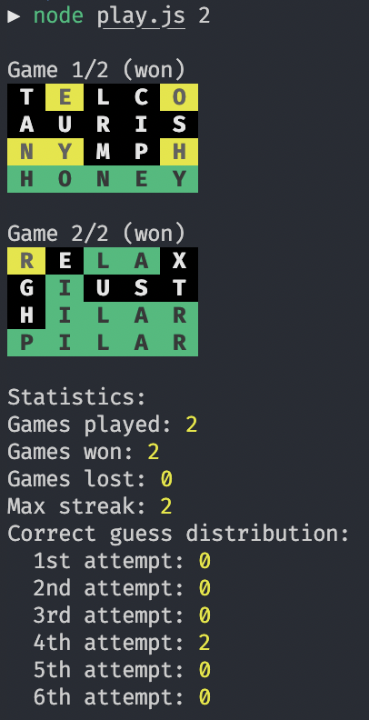

# Wordle solver

Contains some scripts to solve wordle puzzles.

See the files below for the code and instructions:

- `lib/nytimes.js`: solves [Wordle puzzle in NY times](https://www.nytimes.com/games/wordle/index.html).
- `lib/wordlegame.js`: solves [Wordle puzzle in Wordlegame.org](https://wordlegame.org/).

> Average success rate: 92%.

# NodeJS Wordle

Create and solves the puzzles in NodeJS:

```sh
# Create and solve the default amount of puzzles:
node play.js

# Or create and solve a given amount of puzzles:
node play.js 2
```

.

# Requirements

- Node.js
